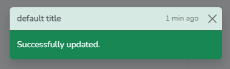

# Toast Manager - Handle Bootstrap notifications dynamically.

Add magic to your website with our basic npm package. Local notifications and dynamic toasts with Bootstrap 5 or higher. Enhance user experience simply and effectively. Discover it now!

## Install

```
npm i @henryht/toast-manager
```

## Usage

1. import the pakage

```
import * as Popper from "@popperjs/core"
window.Popper = Popper;
import * as bootstrap from 'bootstrap';
window.bootstrap = bootstrap;

import * as toastManager from '@henryht/toast-manager';
window.toastManager = toastManager;
```

2. Methods

- The first method will create a more detailed notification.<br />
```toastManager.notify(type:string, title:string, message:string, date:string, options = {});```

This generates: <br />


-This type of notification is useful for displaying the status of a request. <br />
```toastManager.simpleNotify(type:string, message:string, options = {});```

This generates: <br />


- Finally, this method clears the container of notifications with the class `.hide`. This process is automatically performed each time a new notification is created. <br />
```toastManager.clearHide();```

5. HTML container

To add notifications to the DOM, it's necessary to create a container in your HTML with the attribute `id="toast-container"`. To display them in your desired location, simply follow the toast guide on the official [Bootstrap page](https://getbootstrap.com/docs/5.0/components/toasts/#placement).

```
<div class="toast-container position-reelative top-2 end-0 p-3" id="toast-container" style="z-index: 9999">
</div>
```

4. Toast Types (notifications)

- primary 
- secondary 
- danger
- dark
- info
- light
- success
- warning


## License

The Toast Manager is open-sourced library licensed under the [MIT license](https://opensource.org/licenses/MIT).